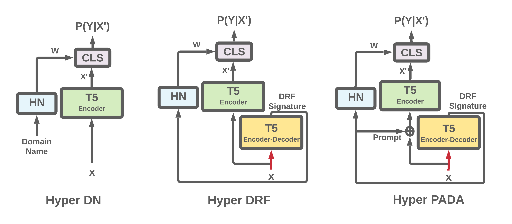

# Hyper Networks for Out of Distribution Generalization in NLP

### Official code repository for the  paper ["Example-based Hypernetworks for Multi-source Adaptation to Unseen Domains"](https://aclanthology.org/2023.findings-emnlp.610/) 
 
We introduce three ways to use hyper networks for the adaptation to unknown domains: Hyper-DN (Domain Name), Hyper-DRF and Hyper-PADA (for more details, see section 3 in the paper).
The models are trained on labeled data from several source domains and then are tested on an unseen target domain.
Hyper DRF and Hyper PADA are



If you use this code please cite our paper (see recommended citation below).

Our code is implemented in [PyTorch](https://pytorch.org/), using the [Transformers](https://github.com/huggingface/transformers) and [PyTorch-Lightning](https://www.pytorchlightning.ai/) libraries. 

## Usage Instructions
First, make sure your virtual environment includes all requirements (specified in 'hn_da_env.yml').

We ran our experiments on a single NVIDIA Quadro RTX 6000 24GB GPU, CUDA 11.1 and PyTorch 1.9.0.

### 0. Setup a conda environment
You can run the following commands to create a conda environment from our .yml file:
```
conda env create --hn_da_env.yml.yml
conda activate hn_da
```

## Training the Models
For running our Hyoernetworks based models on all the experiments described in the paper, run the script `run_multiple_datasets.sh`.
```bash run_multiple_datasets.sh -g 0``` 
The parameter `g` specifies the GPU on which the models will be run.

For running the experiments on a single dataset, run the script `run_single_dataset.sh`. The parameters for this script are g: the GPU as described earlier and d: the dataset on which to run.
For example, the following command will run the experiments of the CLCD sentiment analysis:
```bash run_multiple_datasets.sh -g 1 -d "sentiment"```
The options for the dataset field (d) are:
- `sentiment` - running the sentiment CLCD experiment (Table 4 in the paper).
- `mnli` - running the MNLI CD experiment (Table 5 in the paper).
- `sentiment language <LANG>` - running the sentiment CD experiment in the specified language `<LANG>`. `<LANG>` should be one of: en, de, fr, jp

To run a single model, run the script `run_single_model_single_dataset.sh`.
For example, the command  ```bash run_single_model_single_dataset.sh -g 0 -d mnli -t hyper-dn```
The parameters of the script are `d` and `g` as described above, as well as the model parameter `t`. The options for `t` are `hyper-dn`, `hyper-drf`, and`hyper-pada`.

### Viewing the Results of Your Runs
The final results are saved in the directory: 
  `./results/<TASK_NAME>/<MODEL TYPE> <MODEL NAME>/<METRIC>.csv`. 
  Where metric is Macro-F1 in MNLI and accuracy in sentiment. 
 Each row contains the results from a single run (single model training), including the development
and test results.
 
### Choose Your Own Experimental Configuration
In order to change the hyper-parameters of a specific run, go to the config files folder and edit the file relevant to the dataset you are running.


## How to Cite Our Models
```
@inproceedings{DBLP:conf/emnlp/VolkBACR23,
  author       = {Tomer Volk and
                  Eyal Ben{-}David and
                  Ohad Amosy and
                  Gal Chechik and
                  Roi Reichart},
  editor       = {Houda Bouamor and
                  Juan Pino and
                  Kalika Bali},
  title        = {Example-based Hypernetworks for Multi-source Adaptation to Unseen
                  Domains},
  booktitle    = {Findings of the Association for Computational Linguistics: {EMNLP}
                  2023, Singapore, December 6-10, 2023},
  pages        = {9096--9113},
  publisher    = {Association for Computational Linguistics},
  year         = {2023},
  url          = {https://aclanthology.org/2023.findings-emnlp.610},
  timestamp    = {Wed, 13 Dec 2023 17:20:20 +0100},
  biburl       = {https://dblp.org/rec/conf/emnlp/VolkBACR23.bib},
  bibsource    = {dblp computer science bibliography, https://dblp.org}
}
```
